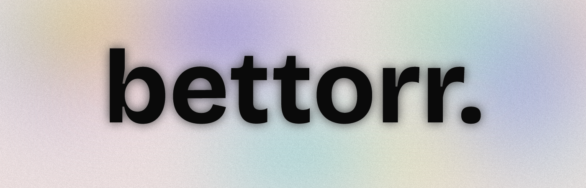

<div align="center">
  
  
  # 🎮 Bettorr - Game Torrent Search Engine
  
  [](https://bettorr.vercel.app)
  [](https://github.com/ctrlcat0x/bettorr)
  [](https://opensource.org/licenses/MIT)
  [](https://github.com/ctrlcat0x/bettorr)
</div>

---

<div align="center">
  <h3>🚀 A modern, minimalistic web interface for searching game torrents from multiple trusted sources</h3>
  <p>Built with a beautiful dark theme featuring glass morphism effects, grain texture, and blur elements for an immersive gaming experience.</p>
</div>

---

## ✨ Features

<div align="center">
  <table>
    <tr>
      <td align="center">
        <b>🔍 Smart Search</b><br>
        Real-time search with intelligent autocomplete functionality
      </td>
      <td align="center">
        <b>🎯 Source Filtering</b><br>
        Filter results by specific trusted sources
      </td>
    </tr>
    <tr>
      <td align="center">
        <b>⚡ Fast Loading</b><br>
        Optimized search with smooth loading states
      </td>
      <td align="center">
        <b>🎨 Modern UI</b><br>
        Dark theme with glass morphism and blur effects
      </td>
    </tr>
    <tr>
      <td align="center">
        <b>📱 Responsive Design</b><br>
        Perfect experience on desktop and mobile
      </td>
      <td align="center">
        <b>🔗 Direct Downloads</b><br>
        One-click magnet link downloads
      </td>
    </tr>
  </table>
</div>

---

## 🎯 Trusted Sources

<div align="center">
  <table>
    <tr>
      <td align="center">
        <b>🎮 DODI Repacks</b><br>
        High-quality game repacks with excellent compression
      </td>
      <td align="center">
        <b>💎 FitGirl Repacks</b><br>
        Compressed game releases with integrity checks
      </td>
    </tr>
    <tr>
      <td align="center">
        <b>⚡ KaosKrew</b><br>
        Game releases and updates from trusted community
      </td>
      <td align="center">
        <b>🌐 OnlineFix</b><br>
        Online multiplayer fixes and patches
      </td>
    </tr>
    <tr>
      <td align="center" colspan="2">
        <b>🎯 Xatab</b><br>
        Game repacks and releases with Russian localization
      </td>
    </tr>
  </table>
</div>

---

## 🚀 Quick Start

<div align="center">
  <h3>Getting Started is Simple!</h3>
</div>

### 1. **🔍 Search for Games**
   - Type in the search bar to find your favorite games
   - Enjoy intelligent autocomplete suggestions as you type
   - Get instant results from multiple sources

### 2. **🎯 Filter by Source**
   - Use filter buttons to search within specific sources
   - Or view all sources for comprehensive results
   - Find exactly what you're looking for faster

### 3. **⬇️ Download Instantly**
   - Click the "Download Magnet" button for your chosen game
   - Get direct magnet links for immediate downloading
   - No redirects, no waiting, just pure speed

---

## 🛠️ Technology Stack

<div align="center">
  <table>
    <tr>
      <td align="center">
        <b>🌐 Frontend</b><br>
        HTML5, CSS3, JavaScript (ES6+)
      </td>
      <td align="center">
        <b>🎨 Design</b><br>
        Glass Morphism, Dark Theme, Animations
      </td>
    </tr>
    <tr>
      <td align="center">
        <b>📱 Responsive</b><br>
        Mobile-first design approach
      </td>
      <td align="center">
        <b>⚡ Performance</b><br>
        Optimized loading and search algorithms
      </td>
    </tr>
    <tr>
      <td align="center" colspan="2">
        <b>🔧 Tools</b><br>
        Font Awesome Icons, Google Fonts (Bricolage Grotesque, Fira Mono, Inter)
      </td>
    </tr>
  </table>
</div>

---

## 📁 Project Structure

```
bettorr/
├── 📄 index.html          # Main HTML file with SEO optimization
├── 🎨 styles.css          # CSS styles with glass morphism effects
├── ⚡ script.js           # JavaScript functionality and search logic
├── 📖 README.md           # This beautiful documentation
├── 🗺️ sitemap.xml        # SEO sitemap for search engines
├── 🤖 robots.txt          # Search engine crawling instructions
└── 📁 magnet_data/        # JSON data files from trusted sources
    ├── dodi.json
    ├── fitgirl.json
    ├── kaoskrew.json
    ├── onlinefix.json
    └── xatab.json
```

---

## 📊 Data Format

Each JSON file contains structured game data for optimal performance:

```json
{
  "name": "source_name",
  "downloads": [
    {
      "title": "Game Title",
      "fileSize": "10.5 GB",
      "uris": ["magnet:?xt=..."],
      "uploadDate": "2024-01-01T00:00:00.000Z"
    }
  ]
}
```

---

## 🌐 Browser Support

<div align="center">
  <table>
    <tr>
      <td align="center">
        <b>✅ Chrome</b><br>
        Recommended
      </td>
      <td align="center">
        <b>✅ Firefox</b><br>
        Full Support
      </td>
      <td align="center">
        <b>✅ Safari</b><br>
        Full Support
      </td>
      <td align="center">
        <b>✅ Edge</b><br>
        Full Support
      </td>
    </tr>
  </table>
</div>

---

## 🤝 Contributing

<div align="center">
  <h3>We welcome contributions from the community!</h3>
</div>

### How to Contribute:

1. **🔧 Fork the Repository**
   - Click the fork button on GitHub
   - Clone your forked repository locally

2. **💡 Make Your Changes**
   - Add new features or improvements
   - Fix bugs or enhance performance
   - Improve documentation

3. **📝 Submit a Pull Request**
   - Create a detailed description of your changes
   - Ensure all tests pass
   - Follow the existing code style

### Areas for Contribution:
- ✨ New features and enhancements
- 🎨 UI/UX improvements
- ⚡ Performance optimizations
- 📚 Documentation updates
- 🐛 Bug fixes
- 🔍 New data sources

---

## 📄 License

<div align="center">
  <p>This project is licensed under the <b>MIT License</b> - see the <a href="LICENSE">LICENSE</a> file for details.</p>
  
  <p><b>Note:</b> This application is for educational purposes. Please ensure you comply with your local laws regarding torrent downloads.</p>
</div>

---

<div align="center">
  <h3>🌟 Star this repository if you found it helpful!</h3>
  
  <p>
    <a href="https://bettorr.vercel.app">🌐 Visit Website</a> •
    <a href="https://github.com/ctrlcat0x/bettorr">📁 View on GitHub</a> •
    <a href="https://github.com/ctrlcat0x/bettorr/issues">🐛 Report Issues</a>
  </p>
  
  <p><b>Made with ❤️ by [ctrlcat0x](https://github.com/ctrlcat0x)</b></p>
</div>
